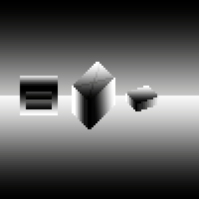

通过Pixpil的微博了解到，Eastward的光照效果中用到了法线贴图。

遂搜索，找到了一篇2D游戏照明的介绍：

> [Lighting a 2D Game](http://www.wholehog-games.com/devblog/2013/06/07/lighting-in-a-2d-game/)

其作者是[《Full_Bore》](http://store.steampowered.com/app/264060/Full_Bore/)的开发者，根据他的介绍，Full Bore 用基本的漫射贴图(Diffuse)、自发光的强度贴图(Self-Illumination)和法线贴图(Normal)来实现最终的光照效果。

虽然之前跟着教程做铁砧时生成过法线贴图，不过并没有明白其原理。法线贴图(Normal Map)通过改变物体表面法线的方向，来改变光照的反射效果,使其看起来并不是一个平面而具有更多细节。法线方向用XYZ三个方向的大小描述，而图片刚好有RGB三个颜色通道。法线贴图的红色通道描述水平方向，绿色通道描述垂直方向，蓝色通道描述垂直于表面的方向。法线贴图中大部分都是淡蓝色是因为平整的地方的法线方向为垂直于表面朝上，所以红绿通道都是中间值127，表示0向量。蓝色通道为255，表示垂直于表面朝上的单位向量。而(127,127,255)就是法线贴图中常见的那种蓝色。

这是尝试像素3D光照的图片：

先根据原图画出凹凸图(Bump Map)：

然后在PS中生成法线图(PS中生成的法线图的红色通道数值表示的法线方向似乎与Unity和Blender中是相反的，所以在生成法线图前需要先把图片水平翻转，生成后再翻转回来保存，并且生成后可能需要进行一些调整。)：

这是在Blender中贴上法线贴图后的效果：

在自发光的物体方面，虽然能通过黑白的自发光强度图在blender中烘焙出emit并应用于Unity，但发出的光不能明显的影响这张图上发光物体周围的像素，效果并不好，还需要继续研究。

接下来想学自己写Shader，看看到底能实现什么。