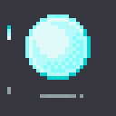

寒假回家第一件事是重新学习了Git，在[Git官方文档](https://git-scm.com/book/zh/v2)看的。
了解了rebase和merge的适用情形，还有分布式开发流程啥的，感觉自己以前用Git就是走个流程，分支标签啥的都不会。

然后是看到了[Eastward的开发日志](http://pixpil.com/archives/6)，被这个画风吸引住了，大小刚好的像素风格和3D光照效果。所以就想自己搞一下，他们网站介绍说美术是用[Aseprite](https://www.aseprite.org/)画的，游戏引擎是基于MOAI的内部框架。刚好自己steam愿望单里Aseprite已经躺了很久了，所以立刻就买下了。然而MOAI官网介绍是用Lua来写控制脚本的，虽然似乎也有改用Python方法，但是为了省得折腾就用以前接触过的Unity了。。

通过Aseprite知道了一位叫[Mort](https://www.youtube.com/user/atMNRArt)的Youtuber，他的视频和直播是一些关于像素画技巧的，然后他是个法国人，口音很有意思。

贴张自己画的IO，尝试过才知道做动画的麻烦。

做了个小角色的动画，用了知乎一位大佬的[MetaSprite](https://github.com/WeAthFoLD/MetaSprite)导入Unity，省去了自己在Unity里建立动画和控制器的步骤。控制脚本什么的也容易写，但是不知道该怎么实现像素效果的3D光照，可能得自己写个shader什么的吧。

Blender方面又在家看了[Blender Guru](https://www.youtube.com/user/AndrewPPrice)的两个教程，分别是甜甜圈和铁砧，比之前B站看的台湾大神系列新一些，并且每个教程结束时的成果也好看点。
贴自己做的（懒得打光了，只加了一个太阳光。。

刚开始在Aseprite画完想转成Voxel,折腾了半天，最后用PS导出SVG轮廓,然后再在blender里导入SVG，把曲线转成mesh，再自己重新设置下UV贴图。

后来发现了MagicaVoxel,导入PNG直接生成 长\*宽\*1 的体素,并且可以导出OBJ格式，很方便。

MagicalVoxel保存的文件为自定义的vox格式，RIFF 格式的文件，有机会深入学习下。

下面是在Unity里瞎玩。。

 

最后是Docker,下载了两三次了，算是稍微会用点了吧。。

以上。